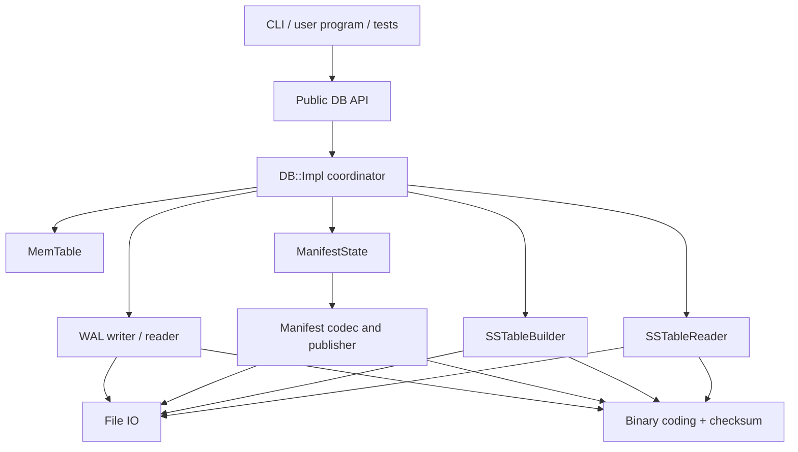
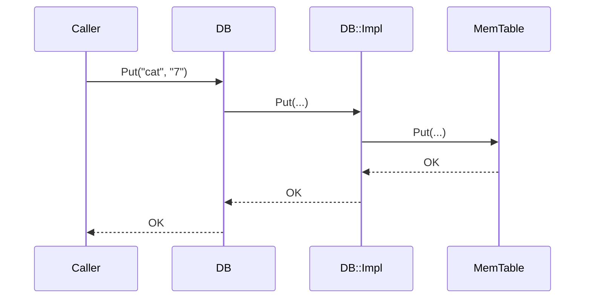
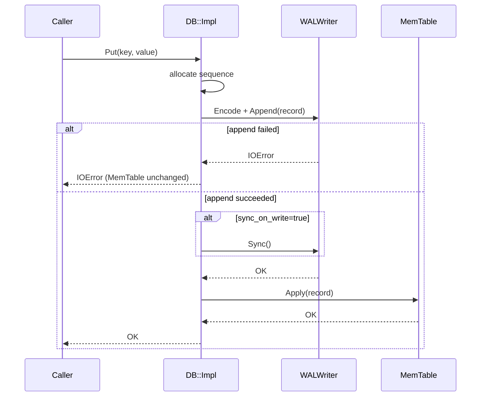
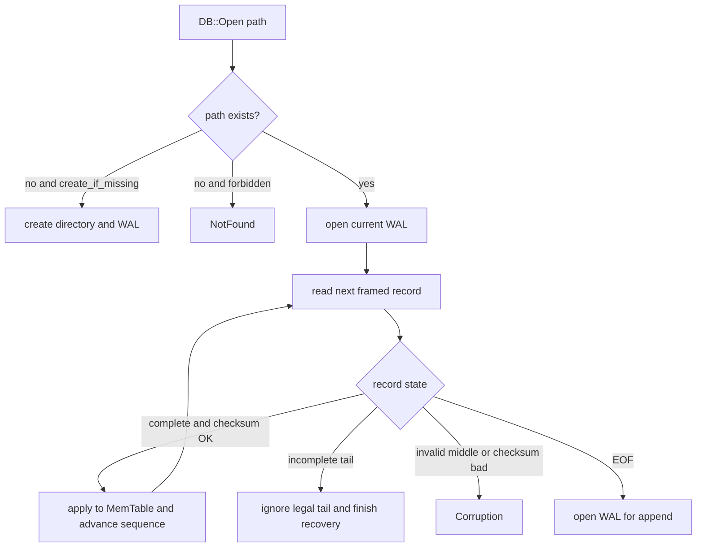
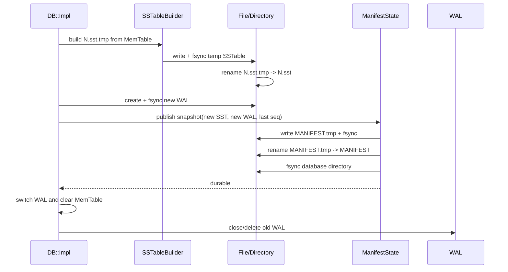
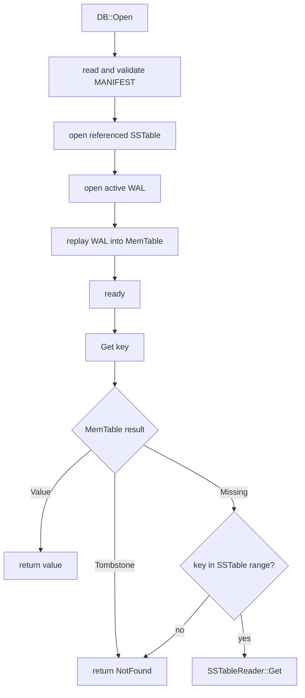

# 2026-08-24 · TinyLSM · V0-V2 源码设计与验收记录

## 记录来源与状态

- 类型：阶段设计 / 实现与验收记录
- 来源：现有 [`init_plan.md`](init_plan.md)、用户对 PImpl/Protobuf 的新想法、2026-08-24 架构问答
- 状态：`V0-V2 已实现并验证`；2026-08-31 完成最终验收
- 配套文档：[`v0-v2-repository-design.md`](v0-v2-repository-design.md)、[`../notes/2026-08-24-tinylsm-v0-v2-foundations.md`](../notes/2026-08-24-tinylsm-v0-v2-foundations.md)

## 1. 目标与边界

本计划只覆盖：

- V0：工程可运行的纯内存 KV；
- V1：WAL、同步语义与重启恢复；
- V2：一个 SSTable、Manifest、第一次安全 flush 与重启读取。

本计划不提前实现：

- 多 SSTable 新旧版本选择（V3）；
- 已落盘旧值上的完整 tombstone 回收（V3/V4）；
- compaction（V4）；
- 跨多个数据源的惰性 Iterator/Scan（V5）；
- 多线程并发、WriteBatch、group commit（V6）；
- Bloom Filter、Block Cache、网络服务或 SQL。

V0-V2 的目标不是生产数据库，而是建立一条可以解释、测试和故障验证的最小持久化链路。

## 2. 最终设计决策

| 决策 | 最终结果 | 状态 | 理由 |
|---|---|---|---|
| 顶层 API | `DB` 使用 PImpl | `已实现` | 隐藏内部存储依赖并保持 public header 稳定 |
| 内部类 | 不使用 PImpl | `已实现` | MemTable/WAL/SSTable 都是 `src/` 内部类型，无 ABI 边界需求 |
| C++ 标准 | C++20 | `已实现` | CMake targets 明确要求 `cxx_std_20` |
| 错误模型 | `Status` + `Result<T>` | `已实现` | 普通失败使用状态码；不以异常表达 NotFound、IOError、Corruption |
| Scan | 物化为 `std::vector<Entry>` | `已实现` | V2 只合并一个 SSTable 与 MemTable，不提前引入 Iterator 生命周期 |
| 并发 | 不承诺线程安全 | `已冻结` | 并发属于后续阶段 |
| WAL 编码 | 自定义 header/payload/CRC32C | `已实现` | 明确 framing、长度限制与尾部截断恢复 |
| Manifest 编码 | 自定义 header/framing/CRC32C + Protobuf payload | `已实现` | 外层负责完整性和发布，Protobuf 表达快照 schema |
| SSTable | 自定义 data/index/footer 格式 | `已实现` | 保留有序 block、index、footer 和独立 CRC32C |
| V2 文件数量 | 最多一个已发布 SSTable | `已冻结` | 第二次 flush 在 WAL/MemTable 修改前返回 `NotSupported` |

## 3. 顶层系统架构



依赖规则：

1. `DB::Impl` 是唯一协调者；WAL、MemTable、SSTable 之间不互相调用。
2. `MemTable` 不做文件 IO。
3. `File`/IO 层不理解数据库 record。
4. `Manifest` 只管理文件元数据，不解析 SSTable 中的 KV。
5. Public header 不包含任何 `src/` 内部头文件。
6. 模块之间通过值类型、`Status`/`Result<T>` 和清楚的 ownership 连接，避免共享可变全局状态。

## 4. Public API 与 PImpl

### 4.1 Public header

```cpp
// include/tinylsm/db.h

namespace tinylsm {

struct Entry {
  std::string key;
  std::string value;
};

struct Options {
  std::size_t memtable_bytes = 4 * 1024 * 1024;
  bool create_if_missing = true;
  bool sync_on_write = true;
  std::uint32_t max_key_bytes = 4 * 1024 * 1024;
  std::uint32_t max_value_bytes = 64 * 1024 * 1024;
  std::size_t sstable_block_bytes = 16 * 1024;
};

class DB final {
 public:
  static Result<std::unique_ptr<DB>> OpenInMemory();  // V0

  static Result<std::unique_ptr<DB>> Open(            // V1+
      const std::filesystem::path& db_path,
      Options options = {});

  ~DB();

  DB(DB&&) noexcept;
  DB& operator=(DB&&) noexcept;
  DB(const DB&) = delete;
  DB& operator=(const DB&) = delete;

  Status Put(std::string_view key, std::string_view value);
  Result<std::string> Get(std::string_view key) const;
  Status Delete(std::string_view key);
  Result<std::vector<Entry>> Scan(std::string_view begin,
                                  std::string_view end) const;

  // 显式返回 close/sync 错误；析构只做 best-effort cleanup。
  Status Close();

 private:
  class Impl;
  explicit DB(std::unique_ptr<Impl> impl);

  std::unique_ptr<Impl> impl_;
};

}  // namespace tinylsm
```

### 4.2 Internal implementation

```cpp
// src/db/db_impl.h

class DB::Impl {
 public:
  static Result<std::unique_ptr<Impl>> OpenInMemory();
  static Result<std::unique_ptr<Impl>> Open(
      const std::filesystem::path& path, Options options);

  Status Put(std::string_view key, std::string_view value);
  Result<std::string> Get(std::string_view key) const;
  Status Delete(std::string_view key);
  Result<std::vector<Entry>> Scan(
      std::string_view begin, std::string_view end) const;
  Status Close();

 private:
  Options options_;
  std::optional<std::filesystem::path> path_;
  std::unique_ptr<internal::FileSystem> fs_;
  internal::MemTable memtable_;
  std::unique_ptr<internal::WalWriter> wal_;
  std::unique_ptr<internal::SSTableReader> table_;
  std::unique_ptr<internal::ManifestState> manifest_;
  std::optional<Status> terminal_error_;
  std::uint64_t next_sequence_ = 1;
  bool closed_ = false;
};
```

PImpl 在本项目中是合理的，但使用范围只限于公开 `DB` façade：

- `db.h` 不需要包含 MemTable、WAL、Manifest 等内部头文件；
- V0 到 V2 增加内部成员时，调用者无需修改源码；
- `DB::~DB()` 必须在能看到完整 `Impl` 定义的 `.cpp` 中定义；
- move 可用，copy 禁止，符合数据库 handle 的唯一资源所有权。

## 5. 公共值类型和错误模型

### 5.1 Status

最小状态码：

```cpp
enum class StatusCode {
  kOk,
  kNotFound,
  kInvalidArgument,
  kIOError,
  kCorruption,
  kResourceExhausted,
  kAlreadyClosed,
  kNotSupported,
};
```

规则：

- `Get` 的空 value 与 NotFound 必须可区分；
- IO 错误保留操作、路径和系统错误信息，但公共错误消息不包含敏感内容；
- Corruption 用于非法格式、checksum 失败、Manifest 引用缺失文件等；
- 析构函数不抛异常；需要观察关闭错误时调用 `Close()`。

### 5.2 key/value 语义

- key/value 是任意 byte string，V0-V2 用 `std::string` 持有；
- 使用明确的 byte-wise comparator，不依赖本地化排序；
- `Put` 覆盖同 key 的当前值；
- `Delete` 幂等；
- `Scan(begin, end)` 为 `[begin, end)`；
- V0-V2 不支持 snapshot API。

## 6. 内部记录模型

V0 可以只保存：

```text
user_key -> value
```

V1 起统一为：

```cpp
enum class ValueType : uint8_t {
  kValue = 1,
  kTombstone = 2,
};

struct InternalEntry {
  std::string user_key;
  uint64_t sequence;
  ValueType type;
  std::string value;
};
```

Sequence number 是单调递增的逻辑版本：

- 每个 Put/Delete 分配一个 sequence；
- sequence 可有空洞，但不能重复或倒退；
- Manifest 保存最后已知 sequence；
- WAL 恢复取合法记录中的最大 sequence，再继续分配；
- 写请求返回错误时，不保证该操作绝对未进入 WAL；调用方需要把结果视为未确认。TinyLSM 不在 V1 引入事务性去重。

V1/V2 的 MemTable 可以先保存每个 user key 的最新 `InternalEntry`，不保留完整历史版本；snapshot 和多版本读取属于后续范围。

## 7. V0：纯内存实现

### 7.1 组件

- `DB` / `DB::Impl`；
- `MemTable`；
- `Status` / `Result<T>` / `Entry` / `Options`；
- CLI 和测试。

### 7.2 数据结构

```cpp
using Map = std::map<std::string, std::string, BytewiseLess>;
```

### 7.3 调用流程



### 7.4 V0 不变量

- `Get` 能区分空 value 和 NotFound；
- `Delete` 对不存在 key 返回 OK；
- Scan 有序且不重复；
- 关闭进程后数据丢失是预期行为；
- 不创建 WAL/SSTable/Manifest 的空实现。

## 8. V1：WAL 与恢复

### 8.1 WAL record 格式提案

所有整数使用固定 little-endian 或明确指定的 varint；第一版优先固定宽度，降低解码复杂度。

开发过程中的 V1 设计曾只包含一个编号 WAL，例如 `000001.wal`。当前 V2
持久化数据库始终以 Manifest 选择有效 WAL/SSTable；仓库没有发布过独立 V1
格式、tag、兼容承诺或旧数据夹具，因此这段阶段设计不构成迁移兼容承诺。

```text
RecordHeader
  magic          u32
  format_version u16
  type           u8
  reserved       u8
  payload_length u32
  checksum       u32

Payload
  sequence       u64
  key_length     u32
  value_length   u32
  key            bytes[key_length]
  value          bytes[value_length]
```

Checksum 覆盖 `type + payload`。字段偏移和 header 大小由常量定义，最大
key/value 长度在分配前检查，并由 golden、字段损坏和超限测试约束；格式不依赖
`sizeof(C++ struct)`。

### 8.2 写入时序



核心不变量：

- WAL append/sync 失败时不更新 MemTable；
- `sync_on_write=true` 时，只有 WAL 同步成功才返回 OK；
- `sync_on_write=false` 时，文档必须说明系统崩溃/断电可能丢失近期写入；
- `write()`、iostream `flush()` 和 `fsync()` 的语义不能混用。

### 8.3 恢复流程



恢复规则：

- 只允许忽略文件尾部不完整 record；
- 中部 checksum/长度错误必须返回 Corruption；
- 解析长度前做上限检查；
- replay 必须使用相同的 `Apply(InternalEntry)` 路径，避免正常写和恢复产生不同语义。

## 9. V2：SSTable、Manifest 与第一次 flush

当前兼容策略不自动迁移 pre-Manifest 数据。缺少 Manifest 时：

- 没有 TinyLSM 文件，创建新的 `000001.wal` 和 Manifest；
- 只有空 `000001.wal`（可伴随 `MANIFEST.tmp`），视为初始化中断并安全重试；
- 非空 `000001.wal` 返回 `NotSupported`，且不得截断或改写；
- 其他编号 WAL、正式/临时 SSTable 或无法解释的初始化状态返回 `Corruption`；
- 已有合法 Manifest 时，它仍是唯一有效文件集合，未引用 orphan 被忽略。

### 9.1 SSTable 最小格式

V2 不做压缩、Bloom Filter、Block Cache。实际格式：

```text
+-------------------------+
| Data Block 0            |
+-------------------------+
| Data Block 1            |
+-------------------------+
| ...                     |
+-------------------------+
| Index Block             |  first/last key + offset + size
+-------------------------+
| Footer                  |  index offset/size + magic + version + checksum
+-------------------------+
```

Data block 中记录按 user key 排序。每个 block 和 footer 有独立校验；Reader 先读固定大小 footer，再定位 index，最后定位可能包含 key 的 data block。

Builder 以 `sstable_block_bytes` 作为目标大小切分 data block，每个 block 生成一条
index entry；单个超大 entry 可以独占超过目标大小的 block。V2 不实现前缀压缩和
restart point。

### 9.2 Manifest 快照格式

V2 先使用完整快照，不实现 LevelDB 式 append-only VersionEdit log：

```cpp
struct TableMeta {
  uint64_t file_number;
  uint64_t file_size;
  std::string smallest_key;
  std::string largest_key;
  uint64_t min_sequence;
  uint64_t max_sequence;
};

struct ManifestSnapshot {
  uint64_t active_wal_number;
  uint64_t next_file_number;
  uint64_t last_sequence;
  std::optional<TableMeta> live_table;  // V2 最多一个
};
```

Manifest 本身也包含 magic、format version、payload length 和 checksum。

### 9.3 ManifestState 与未来 VersionSet

V2 先实现：

```cpp
class ManifestState {
 public:
  static Result<ManifestSnapshot> Load(
      FileSystem& fs, const std::filesystem::path& db_path);
  ManifestPublishOutcome Publish(const ManifestSnapshot& next);
  const ManifestSnapshot& current() const;
};
```

`Publish(next)` 必须先安全写入磁盘，再替换内存 current。V3/V4 再把 `optional<TableMeta>` 扩展成表集合，并演化成管理多个不可变 Version 的 VersionSet。

### 9.4 第一次 flush 的发布协议



发布不变量：

1. Manifest 只引用已经完成并同步的正式 SSTable；
2. 旧 WAL 在 Manifest 持久化前一直保留；
3. 新 Manifest 同时指定新 SSTable、新活跃 WAL 和 `last_sequence`；
4. Manifest 更新前崩溃：旧 Manifest + 旧 WAL 恢复，未引用 SSTable 是 orphan；
5. Manifest 更新后崩溃：新 SSTable + 新 WAL 恢复，旧 WAL 可在打开后清理；
6. V2 已经存在一个 SSTable 时，可能触发第二次 flush 的 Put/Delete 必须在修改 WAL/MemTable 前返回 `NotSupported`。

### 9.5 V2 打开和读取



### 9.6 V2 的 Scan

公开 `Scan` 在 V2 仍然返回物化的 `std::vector<Entry>`，但结果必须同时覆盖单个 SSTable 和当前 MemTable：

```text
SSTable::Scan + MemTable::Scan
              |
              v
  写入 byte-wise ordered map
  （MemTable 同 key 覆盖 SSTable）
              |
        过滤 Tombstone
              |
              v
  vector<Entry> for [begin, end)
```

这只是单 SSTable 与 MemTable 的物化 map 合并，不建立 public Iterator，也不解决
多 SSTable 合并。V5 再把它演化成惰性的多路合并 Iterator。

## 10. 最终编码选择

V0-V2 的最终组合是：

- WAL 使用自定义 fixed-width header、显式 payload 和 CRC32C；
- Manifest 使用自定义 magic/version/length/CRC32C framing，payload 使用
  `ManifestSnapshotProto`；
- SSTable 使用自定义 data block/index/footer，各部分独立校验。

Protobuf 负责 Manifest schema 和变长字段序列化，但不负责 framing、checksum、
长度上限、`fsync`、rename、目录同步、有效文件集合或发布顺序。WAL 和 SSTable
保留自定义格式，避免把 record-tail 恢复和有序 block/index 布局隐藏在序列化库后。

## 11. 测试钩子与可测试性

实际测试边界如下：

- Codec 使用纯函数 `Encode/Decode`；
- `FileSystem`/`WritableFile` 封装 short write、append、sync、close、rename、
  remove、truncate 和目录同步；
- `FaultPlan` 可以按操作、路径后缀、发生次数和操作前后注入失败；
- `DBTestPeer` 只在内部测试中注入 FileSystem，不增加 public API；
- 临时目录和字节损坏工具位于 `tests/test_support` 或具体测试文件。

该边界足以验证 V0-V2 的系统调用失败和 reopen 语义；本阶段不模拟真实断电，也
不抽象生产级 Env。

## 12. 最终验收

验证日期：2026-08-31。

| 范围 | 结果 | 主要证据 |
|---|---|---|
| V0 | `通过` | Put/Get/Delete/Scan、空 value/NotFound、Delete 幂等、任意 byte string 与 byte-wise 顺序 |
| V1 | `通过` | WAL golden/framing/CRC/长度限制、append/sync 失败语义、可选逐写 sync、尾部截断和 reopen |
| V2 | `通过` | 单 SSTable flush、SSTable + MemTable 读取、第二次 flush 提前拒绝、Manifest 引用与 orphan 规则 |
| 故障恢复 | `通过` | 初始化各阶段重试、flush commit 前后恢复、terminal state、旧 WAL 清理失败、真实 Reader/Open 损坏路径 |
| 兼容安全 | `通过` | 非空 pre-Manifest WAL 返回 `NotSupported` 且字节不变；复杂无 Manifest 状态返回 `Corruption` |

实际执行命令：

```text
./run test
./run asan
cmake --preset release -DBUILD_TESTING=ON
cmake --build --preset release
ctest --test-dir build/release --output-on-failure
./run format --check
./run lint dev-debug
git diff --check
```

Debug、Release、ASan/UBSan 均通过 45/45 tests；clang-format、clang-tidy 和
diff whitespace 检查通过。clang-tidy 在 macOS 上由 lint 脚本显式传入当前
Apple SDK sysroot。

## 13. 冻结边界与兼容策略

- V0-V2 没有发布过独立旧格式，因此不承诺 pre-Manifest 自动迁移；
- 不做真实断电实验，当前恢复证据来自系统调用故障注入、字节损坏和 reopen；
- V2 保持同步 flush、最多一个已发布 SSTable、非线程安全；
- 不增加 public Iterator、WriteBatch、group commit、Bloom Filter 或 Block Cache；
- 不把未实现的多 SSTable、compaction、并发或生产 durability 描述为已完成。

## 14. 后续阶段

V0-V2 至此冻结。多 SSTable 版本选择、compaction、并发、惰性 Iterator、CLI
扩展、安装打包、Linux CI 和 benchmark 均留到后续路线单独设计与验收，不在本
记录中提前展开。
