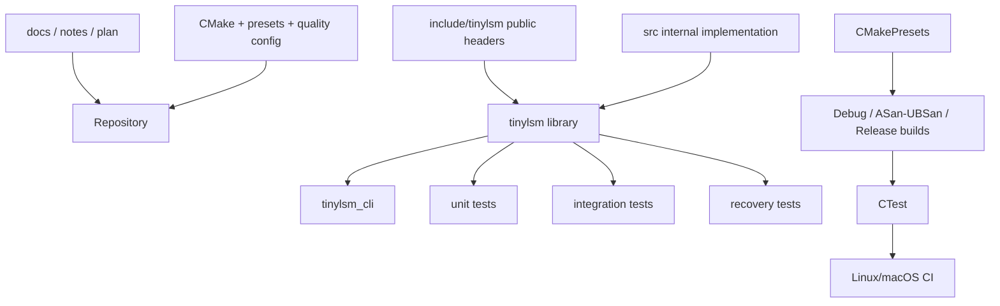
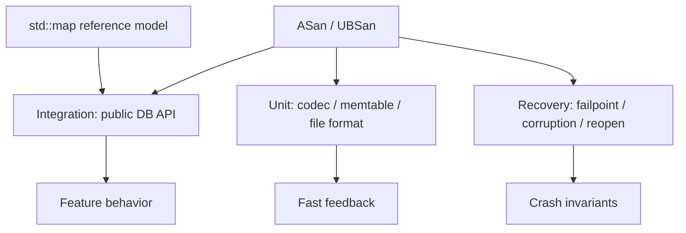
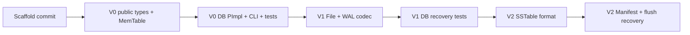

# 2026-08-24 · TinyLSM · V0-V2 仓库与工程设计计划

## 记录来源与状态

- 类型：阶段计划 / AI 讨论成果
- 来源：现有仓库状态、用户要求的“先搭目录并 commit，再填代码”、V0-V2 源码架构讨论
- 最近更新：2026-08-25
- 状态：`scaffold 已创建并验证`；用户已授权按本文档创建仓库骨架，并要求 `src/` 使用 `.h/.cpp` 占位文件而不是空目录
- 配套文档：[`v0-v2-source-design.md`](v0-v2-source-design.md)、[`../notes/2026-08-24-tinylsm-v0-v2-foundations.md`](../notes/2026-08-24-tinylsm-v0-v2-foundations.md)

## 1. 工程目标

仓库应支持以下工作方式：

1. public C++ library 与 CLI、测试分离；
2. V0、V1、V2 每个阶段都能独立构建和验收；
3. Debug、sanitizer、Release 使用可复现 CMake preset；
4. 测试包含 unit、integration、recovery，而不是只做最终 CLI 演示；
5. macOS 用于日常开发，Linux 用于最终文件语义和 CI 验证；
6. 核心 library 在 V0-V2 只依赖 C++ 标准库；
7. 第一次 commit 只建立工程和文档骨架，之后才实现 V0 源码。

## 2. 仓库逻辑分层



仓库中的“源码结构”和“构建结构”保持对应，但 V0-V2 不为每个内部目录创建独立 library。先由一个 `tinylsm` target 包含全部核心源码，避免过早产生 target 间循环依赖和复杂 link 关系。

## 3. 到 V2 时的目标目录树

```text
tinylsm/
├── .clang-format
├── .clang-tidy                    # 初期只提供基础规则，不强制所有检查
├── .editorconfig
├── .gitignore
├── run                            # 薄封装：统一开发命令入口
├── CMakeLists.txt
├── CMakePresets.json
├── README.md                       # V0 开始写，事实与计划分开
├── scripts/
│   ├── common.sh                  # 仓库路径、命令检查和公共函数
│   ├── format.sh                  # clang-format 文件发现与执行
│   ├── lint.sh                    # 基于 compilation database 的 clang-tidy
│   └── package.sh                 # install/package 就绪前明确报告未实现
├── cmake/
│   ├── CompilerWarnings.cmake
│   ├── Sanitizers.cmake
│   └── Dependencies.cmake
├── include/
│   └── tinylsm/
│       ├── db.h
│       ├── options.h
│       ├── result.h
│       ├── status.h
│       └── types.h
├── src/
│   ├── CMakeLists.txt
│   ├── db/
│   │   ├── db.cpp
│   │   ├── db_impl.cpp
│   │   └── db_impl.h
│   ├── memtable/
│   │   ├── memtable.cpp
│   │   └── memtable.h
│   ├── io/                         # V1
│   │   ├── file.cpp
│   │   └── file.h
│   ├── wal/                        # V1
│   │   ├── log_format.h
│   │   ├── wal_reader.cpp
│   │   ├── wal_reader.h
│   │   ├── wal_writer.cpp
│   │   └── wal_writer.h
│   ├── sstable/                    # V2
│   │   ├── sstable_builder.cpp
│   │   ├── sstable_builder.h
│   │   ├── sstable_format.h
│   │   ├── sstable_reader.cpp
│   │   └── sstable_reader.h
│   ├── manifest/                   # V2
│   │   ├── manifest_codec.cpp
│   │   ├── manifest_codec.h
│   │   ├── manifest_state.cpp
│   │   └── manifest_state.h
│   └── util/
│       ├── coding.cpp
│       ├── coding.h
│       ├── crc32c.cpp
│       └── crc32c.h
├── tools/
│   ├── CMakeLists.txt
│   └── tinylsm_cli.cpp
├── tests/
│   ├── CMakeLists.txt
│   ├── test_support/
│   │   ├── file_mutator.cpp
│   │   ├── file_mutator.h
│   │   ├── reference_model.h
│   │   ├── temp_dir.cpp
│   │   └── temp_dir.h
│   ├── unit/
│   │   ├── coding_test.cpp
│   │   ├── manifest_test.cpp
│   │   ├── memtable_test.cpp
│   │   ├── sstable_test.cpp
│   │   └── wal_test.cpp
│   ├── integration/
│   │   ├── db_test.cpp
│   │   ├── flush_test.cpp
│   │   └── reopen_test.cpp
│   └── recovery/
│       ├── corruption_test.cpp
│       ├── flush_crash_test.cpp
│       └── wal_recovery_test.cpp
├── docs/
│   ├── devlog/
│   ├── notes/
│   │   └── 2026-08-24-tinylsm-v0-v2-foundations.md
│   └── plans/
│       ├── init_plan.md
│       ├── v0-v2-repository-design.md
│       └── v0-v2-source-design.md
```

后续但不在 V0-V2 创建：

```text
benchmarks/                         # V7
experiments/                        # 有实际实验时再建
docs/decisions/                     # 需要正式 ADR 时再建
.github/workflows/                  # V0 可构建后添加并实际验证
```

## 4. `include/tinylsm` 与安装边界

CMake public include root 是：

```text
<repo>/include
```

因此调用者写：

```cpp
#include <tinylsm/db.h>
```

而不是依赖绝对路径或 `src/`：

```cpp
// 禁止
#include "../../src/db/db_impl.h"
```

构建 target 配置：

```cmake
target_include_directories(tinylsm
  PUBLIC
    $<BUILD_INTERFACE:${PROJECT_SOURCE_DIR}/include>
    $<INSTALL_INTERFACE:include>
  PRIVATE
    ${PROJECT_SOURCE_DIR}/src
)
```

Public header 只出现稳定 API 和值类型；内部 header 仅通过 `PRIVATE` include path 使用。

## 5. CMake 设计

### 5.1 根 `CMakeLists.txt` 的职责

根文件只负责：

- `cmake_minimum_required` 和 `project`；
- 设置 C++ 标准；
- 定义构建选项；
- 加载 warnings/sanitizers/dependencies；
- `add_subdirectory(src)`；
- 按选项加入 `tools` 和 `tests`；
- 安装/导出 public library（从 V0 library 建立后开始）。

不要在根文件直接列出所有 `.cpp`。

提议选项：

```cmake
option(TINYLSM_BUILD_TOOLS "Build TinyLSM command-line tools" ON)
option(TINYLSM_WARNINGS_AS_ERRORS "Treat compiler warnings as errors" OFF)
option(TINYLSM_ENABLE_ASAN "Enable AddressSanitizer" OFF)
option(TINYLSM_ENABLE_UBSAN "Enable UndefinedBehaviorSanitizer" OFF)
option(TINYLSM_FETCH_TEST_DEPS "Fetch GoogleTest when unavailable" OFF)
```

测试使用 CMake 标准的：

```cmake
include(CTest)  # 提供 BUILD_TESTING
```

不再定义重复的 `TINYLSM_BUILD_TESTS`。

### 5.2 `src/CMakeLists.txt`

V0 建立一个核心 target：

```cmake
add_library(tinylsm STATIC)
add_library(tinylsm::tinylsm ALIAS tinylsm)

target_sources(tinylsm
  PRIVATE
    db/db.cpp
    db/db_impl.cpp
    memtable/memtable.cpp
  PUBLIC
    FILE_SET HEADERS
    BASE_DIRS ${PROJECT_SOURCE_DIR}/include
    FILES
      ${PROJECT_SOURCE_DIR}/include/tinylsm/db.h
      ${PROJECT_SOURCE_DIR}/include/tinylsm/status.h
      ${PROJECT_SOURCE_DIR}/include/tinylsm/result.h
      ${PROJECT_SOURCE_DIR}/include/tinylsm/options.h
      ${PROJECT_SOURCE_DIR}/include/tinylsm/types.h
)

target_compile_features(tinylsm PUBLIC cxx_std_20)
tinylsm_set_warnings(tinylsm)
tinylsm_enable_sanitizers(tinylsm)
```

V1/V2 只对同一个 target 增加源码。初期不建立 `tinylsm_wal`、`tinylsm_sstable` 等子 library。

V0-V2 显式使用 `STATIC`，预期核心产物是 `libtinylsm.a`；CLI 和测试是链接该库的 executable。若以后出现动态发布和 ABI 需求，再单独设计 `SHARED` target，不依赖 `BUILD_SHARED_LIBS` 隐式改变产物类型。

### 5.3 warnings 与 sanitizers

所有编译选项必须 target-scoped，禁止全局修改 `CMAKE_CXX_FLAGS`。

`CompilerWarnings.cmake` 提供：

```cmake
tinylsm_set_warnings(target)
```

按 AppleClang/Clang/GCC 分支设置：

```text
-Wall -Wextra -Wpedantic
```

高噪音或编译器特有 warning 在实际遇到后再加入，不一次复制大型模板。

`Sanitizers.cmake` 提供：

```cmake
tinylsm_enable_sanitizers(target)
```

初版只启用 ASan/UBSan；ThreadSanitizer 在并发版本再加入。

### 5.4 第三方依赖

核心 `tinylsm` target 在 V0-V2：

```text
仅依赖 C++ 标准库和操作系统文件 API
```

不加入 fmt、spdlog、benchmark 或 Protobuf。

GoogleTest 只属于测试构建：

```cmake
find_package(GTest CONFIG QUIET)

if(NOT GTest_FOUND AND TINYLSM_FETCH_TEST_DEPS)
  # FetchContent 使用固定版本/commit
endif()

if(NOT GTest_FOUND)
  message(FATAL_ERROR "GoogleTest not found ...")
endif()
```

默认不在 configure 时静默联网；用户明确开启 `TINYLSM_FETCH_TEST_DEPS` 才下载固定版本。

如果以后选择 Protobuf：

- 新增 `proto/` 只存 `.proto`；
- 生成的 `.pb.h/.pb.cc` 放 build tree，不提交；
- Protobuf 必须成为显式依赖并进入 CI；
- 仍需自定义 WAL framing/checksum 和 SSTable 格式。

当前计划推荐不引入，因此目标树没有 `proto/`。

## 6. CMake Presets

`CMakePresets.json` 提供至少三个 preset：

| Preset | Build type | 用途 |
|---|---|---|
| `dev-debug` | Debug | 日常开发、全部测试 |
| `dev-asan-ubsan` | Debug | 内存和未定义行为检查 |
| `release` | Release | 后期 benchmark/发布前验证 |

建议命令：

```bash
cmake --preset dev-debug
cmake --build --preset dev-debug
ctest --preset dev-debug

cmake --preset dev-asan-ubsan
cmake --build --preset dev-asan-ubsan
ctest --preset dev-asan-ubsan
```

Preset 的 binary directory 固定在被 `.gitignore` 排除的 `build/<preset>`。

### 6.1 `./run` 与配套脚本

仓库根目录提供无扩展名的 `./run` 作为开发者入口；它是 CMake/CTest/CPack 的薄调度层，不复制编译器参数，也不成为第二套构建系统。

初版命令接口：

```text
./run configure [preset]
./run build [preset]
./run test [preset]
./run cli [-- CLI 参数...]
./run format [--check]
./run lint [preset]
./run asan
./run release
./run clean [preset]
./run package
```

职责边界：

- `run`：解析子命令，组合并转发到 CMake preset、CTest 或 `scripts/`；
- `scripts/common.sh`：解析仓库根目录、检查依赖命令、打印实际执行命令；
- `scripts/format.sh`：只处理仓库内受版本控制的 C/C++ 源文件；
- `scripts/lint.sh`：使用 `build/<preset>/compile_commands.json`，缺失时明确提示先 configure/build；
- `scripts/package.sh`：在 install/CPack 尚未设计前返回明确的“未实现”，不生成假包；
- `clean`：调用生成器的 `clean` target，不递归删除仓库或整个 build 根目录。

脚本必须使用严格错误处理，正确引用路径和参数，并把底层命令打印出来，确保用户仍能学习和直接执行原生 CMake/CTest 命令。V0 target 尚未建立前，`cli`、`lint` 和 `package` 可以明确报告阶段性不可用；`configure`、`build`、`test`、`asan`、`release` 和安全的 `clean` 应能正常调度。

## 7. Tools 设计

`tools/CMakeLists.txt`：

```cmake
add_executable(tinylsm_cli tinylsm_cli.cpp)
target_link_libraries(tinylsm_cli PRIVATE tinylsm::tinylsm)
```

CLI 只能通过 public API 操作数据库，用来验证真实调用者体验，不允许 include `db_impl.h`。

V1/V2 的 `wal_dump`、`sstable_dump`、`manifest_dump` 先作为候选，不在本计划自动创建。若确实需要读取内部格式，可以：

- 将 codec 提取为内部 object library；或
- 让 dump 工具作为仅仓库内构建的 diagnostic target，显式使用 `src` private headers。

不要为了一个调试工具把内部 parser 暴露成 public API。

## 8. Test 工程设计

### 8.1 分层



### 8.2 测试 target

建议按模块建立小型 executable：

```text
tinylsm_memtable_test
tinylsm_coding_test
tinylsm_wal_test
tinylsm_sstable_test
tinylsm_manifest_test
tinylsm_db_test
tinylsm_recovery_test
```

每个 target 使用：

```cmake
target_link_libraries(test_target
  PRIVATE tinylsm::tinylsm GTest::gtest_main)

gtest_discover_tests(test_target)
```

内部单元测试可以通过 test target 的 `PRIVATE` include path 访问 `src/` 内部 header；public API 集成测试只能包含 `include/tinylsm`。

### 8.3 `test_support`

- `TempDir`：每个测试独立数据库目录，RAII 清理；
- `FileMutator`：截断文件、翻转某个字节、删除指定文件；
- `ReferenceModel`：用 `std::map` 解释 Put/Get/Delete/Scan；
- failpoint helper：只在测试构建启用；
- 不在测试里依赖用户 home、固定绝对路径、已有数据库或执行顺序。

### 8.4 版本测试矩阵

| 测试 | V0 | V1 | V2 |
|---|---:|---:|---:|
| Put/Get/Delete/Scan | 必须 | 回归 | 回归 |
| 随机操作对比 `std::map` | 必须 | 加 reopen | 加 flush |
| WAL encode/decode | - | 必须 | 回归 |
| WAL 尾部截断/中部损坏 | - | 必须 | 回归 |
| SSTable builder/reader | - | - | 必须 |
| Manifest 原子发布 | - | - | 必须 |
| flush 故障点恢复 | - | - | 必须 |
| ASan/UBSan | 必须 | 必须 | 必须 |

测试命名描述行为，不绑定内部实现，例如：

```text
ReopenRecoversSyncedWrites
TruncatedTailDoesNotHideEarlierRecords
ManifestNeverReferencesIncompleteTable
```

## 9. 格式化、静态分析和生成文件

### `.clang-format`

- 以 LLVM 风格为基础；
- 2 空格缩进；
- 具体列宽和 include 排序在首次格式化前确认；
- 格式化是机械修改，可以由命令批量执行。

### `.clang-tidy`

初期只启用低误报集合，例如：

```text
bugprone-*
performance-*
modernize-use-nullptr
```

不在第一天开启大规模命名规则或 `-warnings-as-errors=*`，避免工具配置压过功能实现。

### 生成文件

以下不能提交：

```text
build/
CMakeFiles/
compile_commands.json 的本地副本
sanitizer/coverage 输出
临时数据库目录
*.sst.tmp
```

如需 IDE 使用 `compile_commands.json`，由 preset 生成，并通过 symlink 或 IDE 配置指向 build tree，不把机器路径写入仓库。

## 10. CI 计划

CI 在 V0 library/tests 可运行且创建 GitHub remote 后加入，而不是第一次 scaffold commit 就加入无法验证的 YAML。

最小 matrix：

```text
ubuntu-latest + Clang/GCC 中至少一个
macos-latest + AppleClang
```

流水线：


Linux 是 V1/V2 持久化语义的必要验证平台。macOS 成功不能替代 Linux 恢复测试。

## 11. 文档布局

现有布局不在这次重构：

- `docs/plans/init_plan.md`：最初候选项目范围；
- `docs/plans/v0-v2-*.md`：待评审、可执行的源码与仓库设计计划；
- `docs/devlog/YYYY-MM-DD.md`：已验证的按日进度；
- `docs/notes/`：按主题组织的学习笔记，并以本地 Markdown 为正文权威源；需要跨设备索引的笔记在 Notion `项目文档与记录` 中建立摘要和反向链接。

README 从 V0 开始，只写已实现能力，并将未来内容标为 roadmap。计划中的功能、测试和性能不能提前写成成果。

## 12. 下一步首次 scaffold commit

用户批准两份计划后，第一步只建立仓库工程骨架并 commit，不填业务代码。

### 12.1 该 commit 创建

```text
.clang-format
.clang-tidy
.editorconfig
run
CMakeLists.txt
CMakePresets.json
scripts/common.sh
scripts/format.sh
scripts/lint.sh
scripts/package.sh
cmake/CompilerWarnings.cmake
cmake/Sanitizers.cmake
cmake/Dependencies.cmake
include/tinylsm/.gitkeep
src/CMakeLists.txt
src/db/db.cpp
src/db/db_impl.cpp
src/db/db_impl.h
src/memtable/memtable.cpp
src/memtable/memtable.h
src/io/file.cpp
src/io/file.h
src/wal/log_format.h
src/wal/wal_reader.cpp
src/wal/wal_reader.h
src/wal/wal_writer.cpp
src/wal/wal_writer.h
src/sstable/sstable_builder.cpp
src/sstable/sstable_builder.h
src/sstable/sstable_format.h
src/sstable/sstable_reader.cpp
src/sstable/sstable_reader.h
src/manifest/manifest_codec.cpp
src/manifest/manifest_codec.h
src/manifest/manifest_state.cpp
src/manifest/manifest_state.h
src/util/coding.cpp
src/util/coding.h
src/util/crc32c.cpp
src/util/crc32c.h
tools/CMakeLists.txt
tests/CMakeLists.txt
tests/test_support/.gitkeep
tests/unit/.gitkeep
tests/integration/.gitkeep
tests/recovery/.gitkeep
```

同时保留并提交当前已有的 `.gitignore` 和 `docs/` 文档。

`src/` 中的 `.h/.cpp` 只包含阶段和职责说明，不声明假的 C++ 类，不加入尚未存在的 library target，也不把 V1/V2 功能表述成已实现。其他尚无明确代码边界的目录使用 `.gitkeep` 跟踪；出现真实文件时立即删除 `.gitkeep`。

### 12.2 该 commit 的 CMake 状态

- `cmake --preset dev-debug` 必须能成功 configure；
- 暂时没有 `tinylsm` target 和测试是允许的；
- 不伪造“测试通过”结果，只记录“configure 成功，尚无源码 target”；
- 不加入 CI、install/export 或第三方下载。

### 12.3 commit 前检查

```bash
git status --short --branch
git diff --check
cmake --preset dev-debug
cmake --build --preset dev-debug
git diff --cached --check
```

还必须确认：

- Git `user.name` / `user.email` 已由用户确认；
- commit 中没有 build 产物和本机绝对路径；
- 没有覆盖用户已有暂存内容；
- commit message 与实际范围一致。

建议 commit message：

```text
chore: scaffold TinyLSM repository structure
```

## 13. scaffold 后的提交路线



不要求每个版本只能一个 commit。每个 commit 应满足：

- 单一可解释目的；
- 构建和相关测试通过；
- 不把计划写成已完成；
- 变更可以 review 和回退。

## 14. 本次执行采用的计划项

用户于 2026-08-25 指示直接按本计划构建仓库，因此 scaffold 采用以下计划项：

1. 创建 V0-V2 目录；`src/` 按用户的新要求使用带职责注释的 `.h/.cpp` 占位，其他空目录使用 `.gitkeep`；
2. scaffold 只保证 CMake configure/build 成功，不创建假的 library、CLI 或测试 target；
3. 核心 library 到 V2 不依赖 Protobuf/fmt/spdlog，测试依赖等实际加入首个测试 target 时再落地；
4. 保留“GoogleTest 本地优先，显式开启时才允许固定版本 FetchContent”的设计，不在 scaffold 阶段联网；
5. 使用 C++20 目标设计和 `dev-debug` / `dev-asan-ubsan` / `release` 三个 preset；
6. CI 等 V0 可运行且 GitHub remote 建立后再添加。

## 15. 执行停止点

本计划已获得 scaffold 执行授权。本次执行完成后停止在以下边界：

- 不开始 V0 KV 业务实现；
- 不创建假的 library、CLI 或测试 target；
- 不下载第三方依赖；
- 不创建 GitHub remote 或 CI；
- 后续填入 V0 代码前等待用户继续指示。
