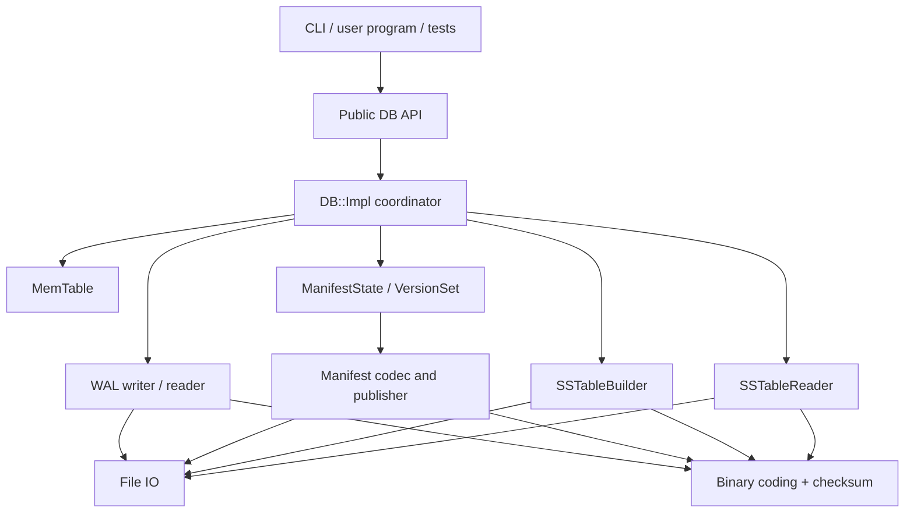
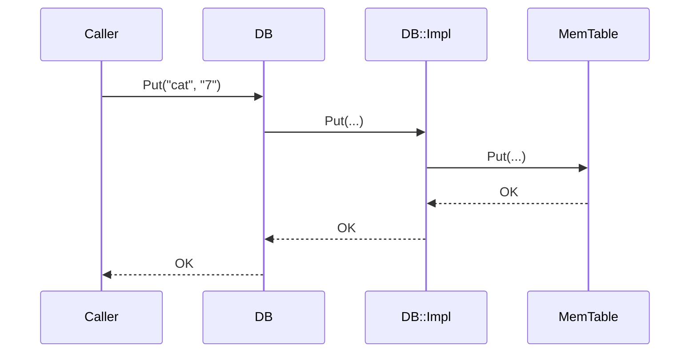
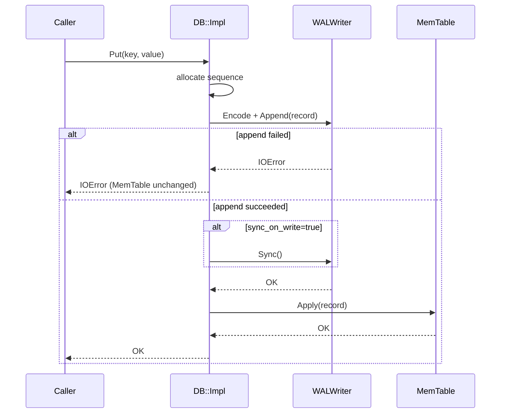
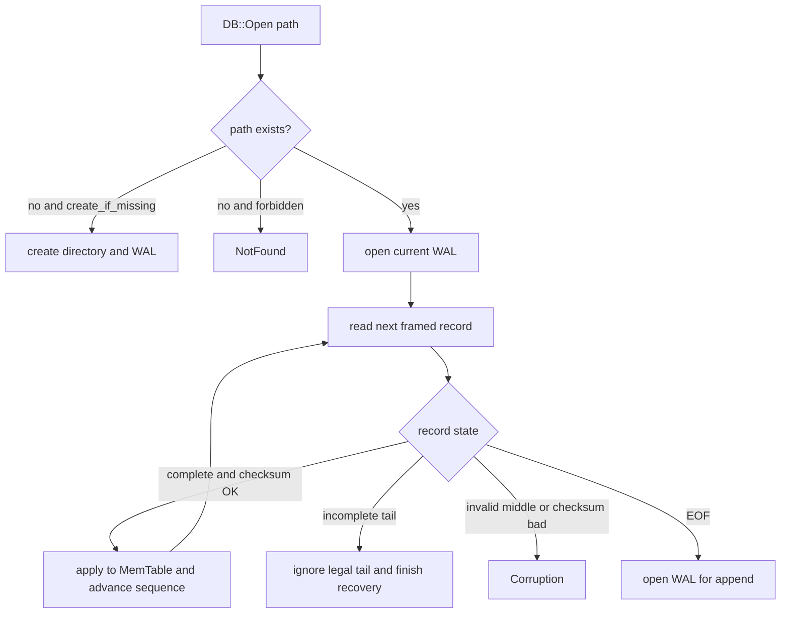
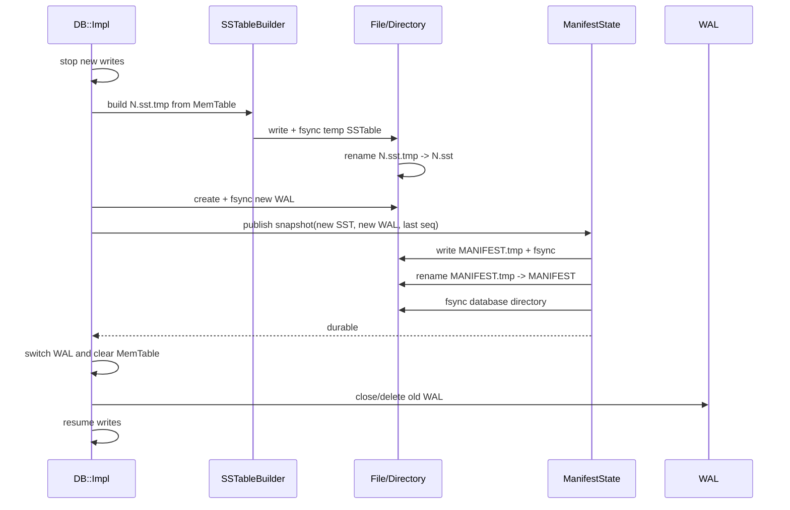
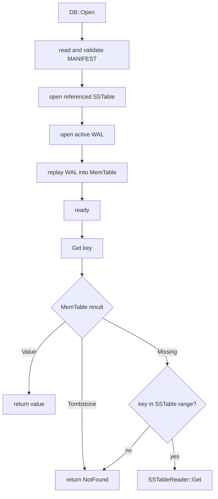

# 2026-08-24 · TinyLSM · V0-V2 源码设计计划

## 记录来源与状态

- 类型：阶段计划 / AI 讨论成果
- 来源：现有 [`init_plan.md`](init_plan.md)、用户对 PImpl/Protobuf 的新想法、2026-08-24 架构问答
- 状态：`计划，待用户评审`；没有源码实现、测试结果或性能数据
- 配套文档：[`v0-v2-repository-design.md`](v0-v2-repository-design.md)、[`../notes/2026-08-24-tinylsm-v0-v2-foundations.md`](../notes/2026-08-24-tinylsm-v0-v2-foundations.md)

## 1. 目标与边界

本计划只覆盖：

- V0：工程可运行的纯内存 KV；
- V1：WAL、同步语义与重启恢复；
- V2：一个 SSTable、Manifest、第一次安全 flush 与重启读取。

本计划不提前实现：

- 多 SSTable 新旧版本选择（V3）；
- 已落盘旧值上的完整 tombstone 回收（V3/V4）；
- compaction（V4）；
- 跨多个数据源的惰性 Iterator/Scan（V5）；
- 多线程并发、WriteBatch、group commit（V6）；
- Bloom Filter、Block Cache、网络服务或 SQL。

V0-V2 的目标不是生产数据库，而是建立一条可以解释、测试和故障验证的最小持久化链路。

## 2. 提议中的设计决策

| 决策 | 提议 | 状态 | 理由 |
|---|---|---|---|
| 顶层 API | `DB` 使用 PImpl | `建议接受，待用户确认` | V0-V2 内部成员变化大，适合隐藏依赖并稳定 public header |
| 内部类 | 不使用 PImpl | `建议接受` | MemTable/WAL/SSTable 都是 `src/` 内部类型，无 ABI 边界需求 |
| C++ 标准 | C++20 | `待确认` | 当前工具链支持；项目仍主要使用 C++17 可用特性 |
| 错误模型 | `Status` + `Result<T>` | `建议接受` | 明确表达 NotFound、IOError、Corruption，不用异常表示普通控制流 |
| Scan | V0-V2 物化为 `std::vector<Entry>` | `建议接受` | 避免提前设计跨 MemTable/SSTable 的 Iterator 生命周期 |
| 并发 | V0-V2 不承诺线程安全 | `建议接受` | 并发计划属于 V6，先验证恢复与文件格式 |
| WAL/Manifest 编码 | 自定义、显式、带版本的最小二进制格式 | `建议接受，待用户确认` | 训练 framing、校验、截断恢复和格式演进；避免核心依赖 Protobuf |
| SSTable | 自定义 data/index/footer 格式 | `建议接受` | Protobuf 不适合替代有序 block/index 文件布局 |
| V2 文件数量 | 最多一个已发布 SSTable | `按当前路线执行` | 多 SSTable 属于 V3；V2 的限制必须安全、显式 |

## 3. 顶层系统架构



依赖规则：

1. `DB::Impl` 是唯一协调者；WAL、MemTable、SSTable 之间不互相调用。
2. `MemTable` 不做文件 IO。
3. `File`/IO 层不理解数据库 record。
4. `Manifest` 只管理文件元数据，不解析 SSTable 中的 KV。
5. Public header 不包含任何 `src/` 内部头文件。
6. 模块之间通过值类型、`Status`/`Result<T>` 和清楚的 ownership 连接，避免共享可变全局状态。

## 4. Public API 与 PImpl

### 4.1 Public header

```cpp
// include/tinylsm/db.h

namespace tinylsm {

struct Entry {
  std::string key;
  std::string value;
};

struct Options {
  std::size_t memtable_bytes = 4 * 1024 * 1024;
  bool create_if_missing = true;
  bool sync_on_write = true;
};

class DB final {
 public:
  static Result<std::unique_ptr<DB>> OpenInMemory();  // V0

  static Result<std::unique_ptr<DB>> Open(            // V1+
      const std::filesystem::path& db_path,
      Options options = {});

  ~DB();

  DB(DB&&) noexcept;
  DB& operator=(DB&&) noexcept;
  DB(const DB&) = delete;
  DB& operator=(const DB&) = delete;

  Status Put(std::string_view key, std::string_view value);
  Result<std::string> Get(std::string_view key) const;
  Status Delete(std::string_view key);
  Result<std::vector<Entry>> Scan(std::string_view begin,
                                  std::string_view end) const;

  // 显式返回 close/sync 错误；析构只做 best-effort cleanup。
  Status Close();

 private:
  class Impl;
  explicit DB(std::unique_ptr<Impl> impl);

  std::unique_ptr<Impl> impl_;
};

}  // namespace tinylsm
```

### 4.2 Internal implementation

```cpp
// src/db/db_impl.h

class DB::Impl {
 public:
  static Result<std::unique_ptr<Impl>> OpenInMemory();
  static Result<std::unique_ptr<Impl>> Open(
      const Path& path, const Options& options);

  Status Put(std::string_view key, std::string_view value);
  Result<std::string> Get(std::string_view key) const;
  Status Delete(std::string_view key);
  Result<std::vector<Entry>> Scan(KeyRange range) const;
  Status Close();

 private:
  Options options_;
  std::optional<Path> db_path_;
  MemTable memtable_;

  // V1 新增
  std::unique_ptr<WALWriter> wal_;
  uint64_t next_sequence_ = 1;

  // V2 新增
  std::unique_ptr<ManifestState> manifest_state_;
  std::unique_ptr<SSTableReader> table_;
};
```

PImpl 在本项目中是合理的，但使用范围只限于公开 `DB` façade：

- `db.h` 不需要包含 MemTable、WAL、Manifest 等内部头文件；
- V0 到 V2 增加内部成员时，调用者无需修改源码；
- `DB::~DB()` 必须在能看到完整 `Impl` 定义的 `.cpp` 中定义；
- move 可用，copy 禁止，符合数据库 handle 的唯一资源所有权。

## 5. 公共值类型和错误模型

### 5.1 Status

最小状态码：

```cpp
enum class StatusCode {
  kOk,
  kNotFound,
  kInvalidArgument,
  kIOError,
  kCorruption,
  kAlreadyClosed,
  kNotSupported,
};
```

规则：

- `Get` 的空 value 与 NotFound 必须可区分；
- IO 错误保留操作、路径和系统错误信息，但公共错误消息不包含敏感内容；
- Corruption 用于非法格式、checksum 失败、Manifest 引用缺失文件等；
- 析构函数不抛异常；需要观察关闭错误时调用 `Close()`。

### 5.2 key/value 语义

- key/value 是任意 byte string，V0-V2 用 `std::string` 持有；
- 使用明确的 byte-wise comparator，不依赖本地化排序；
- `Put` 覆盖同 key 的当前值；
- `Delete` 幂等；
- `Scan(begin, end)` 为 `[begin, end)`；
- V0-V2 不支持 snapshot API。

## 6. 内部记录模型

V0 可以只保存：

```text
user_key -> value
```

V1 起统一为：

```cpp
enum class ValueType : uint8_t {
  kValue = 1,
  kTombstone = 2,
};

struct InternalEntry {
  std::string user_key;
  uint64_t sequence;
  ValueType type;
  std::string value;
};
```

Sequence number 是单调递增的逻辑版本：

- 每个 Put/Delete 分配一个 sequence；
- sequence 可有空洞，但不能重复或倒退；
- Manifest 保存最后已知 sequence；
- WAL 恢复取合法记录中的最大 sequence，再继续分配；
- 写请求返回错误时，不保证该操作绝对未进入 WAL；调用方需要把结果视为未确认。TinyLSM 不在 V1 引入事务性去重。

V1/V2 的 MemTable 可以先保存每个 user key 的最新 `InternalEntry`，不保留完整历史版本；snapshot 和多版本读取属于后续范围。

## 7. V0：纯内存实现

### 7.1 组件

- `DB` / `DB::Impl`；
- `MemTable`；
- `Status` / `Result<T>` / `Entry` / `Options`；
- CLI 和测试。

### 7.2 数据结构

```cpp
using Map = std::map<std::string, std::string, BytewiseLess>;
```

### 7.3 调用流程



### 7.4 V0 不变量

- `Get` 能区分空 value 和 NotFound；
- `Delete` 对不存在 key 返回 OK；
- Scan 有序且不重复；
- 关闭进程后数据丢失是预期行为；
- 不创建 WAL/SSTable/Manifest 的空实现。

## 8. V1：WAL 与恢复

### 8.1 WAL record 格式提案

所有整数使用固定 little-endian 或明确指定的 varint；第一版优先固定宽度，降低解码复杂度。

V1 数据库目录中只允许一个编号 WAL，例如 `000001.wal`。因为 V1 尚无 Manifest，打开时若发现零个 WAL（且允许创建）则新建；发现一个则恢复；发现多个则返回 Corruption，不猜测哪个最新。

```text
RecordHeader
  magic          u32
  format_version u16
  type           u8
  reserved       u8
  payload_length u32
  checksum       u32

Payload
  sequence       u64
  key_length     u32
  value_length   u32
  key            bytes[key_length]
  value          bytes[value_length]
```

Checksum 覆盖 `type + payload`。格式实现前需要把每个字段偏移、最大 key/value/record 大小写成常量和测试，不依赖 `sizeof(C++ struct)`。

### 8.2 写入时序



核心不变量：

- WAL append/sync 失败时不更新 MemTable；
- `sync_on_write=true` 时，只有 WAL 同步成功才返回 OK；
- `sync_on_write=false` 时，文档必须说明系统崩溃/断电可能丢失近期写入；
- `write()`、iostream `flush()` 和 `fsync()` 的语义不能混用。

### 8.3 恢复流程



恢复规则：

- 只允许忽略文件尾部不完整 record；
- 中部 checksum/长度错误必须返回 Corruption；
- 解析长度前做上限检查；
- replay 必须使用相同的 `Apply(InternalEntry)` 路径，避免正常写和恢复产生不同语义。

## 9. V2：SSTable、Manifest 与第一次 flush

V2 第一次打开一个 V1 数据库时，如果不存在 Manifest、目录中恰好只有一个合法 WAL 且没有 SSTable，则创建初始 Manifest 引用该 WAL。若目录状态更复杂或含未解释的正式 SSTable，则拒绝自动迁移并返回 Corruption，避免猜测文件归属。

### 9.1 SSTable 最小格式

V2 不做压缩、Bloom Filter、Block Cache。建议格式：

```text
+-------------------------+
| Data Block 0            |
+-------------------------+
| Data Block 1            |
+-------------------------+
| ...                     |
+-------------------------+
| Index Block             |  first/last key + offset + size
+-------------------------+
| Footer                  |  index offset/size + magic + version + checksum
+-------------------------+
```

Data block 中记录按 user key 排序。每个 block 和 footer 有独立校验；Reader 先读固定大小 footer，再定位 index，最后定位可能包含 key 的 data block。

V2 可以用简单的“每 N 条记录一个 index entry”，不实现前缀压缩和 restart point。

### 9.2 Manifest 快照格式

V2 先使用完整快照，不实现 LevelDB 式 append-only VersionEdit log：

```cpp
struct TableMeta {
  uint64_t file_number;
  uint64_t file_size;
  std::string smallest_key;
  std::string largest_key;
  uint64_t min_sequence;
  uint64_t max_sequence;
};

struct ManifestSnapshot {
  uint32_t format_version;
  uint64_t active_wal_number;
  uint64_t next_file_number;
  uint64_t last_sequence;
  std::optional<TableMeta> live_table;  // V2 最多一个
};
```

Manifest 本身也包含 magic、format version、payload length 和 checksum。

### 9.3 ManifestState 与未来 VersionSet

V2 先实现：

```cpp
class ManifestState {
 public:
  static Result<ManifestState> Recover(const Path& db_path);
  Status Publish(const ManifestSnapshot& next);
  const ManifestSnapshot& Current() const;
};
```

`Publish(next)` 必须先安全写入磁盘，再替换内存 current。V3/V4 再把 `optional<TableMeta>` 扩展成表集合，并演化成管理多个不可变 Version 的 VersionSet。

### 9.4 第一次 flush 的发布协议



发布不变量：

1. Manifest 只引用已经完成并同步的正式 SSTable；
2. 旧 WAL 在 Manifest 持久化前一直保留；
3. 新 Manifest 同时指定新 SSTable、新活跃 WAL 和 `last_sequence`；
4. Manifest 更新前崩溃：旧 Manifest + 旧 WAL 恢复，未引用 SSTable 是 orphan；
5. Manifest 更新后崩溃：新 SSTable + 新 WAL 恢复，旧 WAL 可在打开后清理；
6. V2 已经存在一个 SSTable 时，可能触发第二次 flush 的 Put/Delete 必须在修改 WAL/MemTable 前返回 `NotSupported` 或 `Busy`。

### 9.5 V2 打开和读取



### 9.6 V2 的 Scan

公开 `Scan` 在 V2 仍然返回物化的 `std::vector<Entry>`，但结果必须同时覆盖单个 SSTable 和当前 MemTable：

```text
SSTable 有序记录流 + MemTable 有序记录流
                  |
                  v
             two-way merge
                  |
         同 key 时 MemTable 更新
                  |
            过滤 Tombstone
                  |
                  v
        vector<Entry> for [begin, end)
```

这只是单 SSTable 与 MemTable 的两路物化合并，不建立 public Iterator，也不解决多 SSTable 合并。V5 再把它演化成惰性的多路合并 Iterator。

## 10. Protobuf 设计评审

### 10.1 可以怎样使用

如果选择 Protobuf，WAL 仍需外层 framing：

```text
length | crc32c | serialized WalRecord protobuf
```

Manifest 可以把 `ManifestSnapshot` 序列化为 protobuf payload，然后继续使用：

```text
write temp -> fsync -> rename -> directory fsync
```

### 10.2 Protobuf 能解决什么

- schema 和字段编号；
- 变长字段序列化；
- 未知字段兼容；
- 减少手写 payload 编解码代码。

### 10.3 Protobuf 不能解决什么

- record framing；
- torn/partial record 识别；
- checksum；
- 最大长度和资源限制；
- `fsync`、rename 和目录同步；
- SSTable block/index/footer；
- 文件有效集合和发布顺序。

### 10.4 当前推荐

V0-V2 不直接依赖 Protobuf：

- WAL、Manifest 使用小型、带版本、带 checksum 的自定义格式；
- SSTable 必须自定义 block/index/footer；
- 编解码代码独立为 `WalRecordCodec`、`ManifestCodec`、`BlockCodec`，并用 golden/corruption 测试约束；
- V2 完成后可做一次实验：Manifest 自定义编码与 Protobuf 编码在代码量、文件大小、兼容性和恢复测试上的对比。

理由不是“Protobuf 不好”，而是本项目的重要学习目标正是理解持久化格式和恢复边界；直接依赖 Protobuf 会隐藏一部分需要亲自掌握的问题，而且仍无法替代其他部分。

## 11. 测试钩子与可测试性

源码层预留的测试边界：

- Codec 使用纯函数 `Encode/Decode`；
- `File` 封装处理 short write、sync、rename 和错误转换；
- `DB::Impl` 将写入、恢复、flush 拆成可观察步骤；
- failpoint 只在测试构建启用；
- 临时目录和文件损坏工具放在 tests/test_support，不进入 public API。

不为测试提前抽象整个 `Env` 或模拟所有系统调用；当 V1/V2 恢复测试确实需要注入失败时，再增加最小 `FileSystem` 接口或 failpoint。

## 12. 分阶段实现顺序与验收

### V0

实现顺序：

1. Status/Result/Entry；
2. MemTable；
3. DB PImpl façade；
4. CLI；
5. API、参考模型和 sanitizer 测试。

验收：Put/Get/Delete/Scan 语义正确，library/CLI/tests 构建通过，ASan/UBSan 无报告。

### V1

实现顺序：

1. fixed-width/length-prefix/checksum 工具；
2. File append/read/sync；
3. WalRecordCodec；
4. WALWriter/WALReader；
5. DB 写路径；
6. Open/replay；
7. 截断、损坏、reopen 测试。

验收：同步成功写入可恢复；尾部截断可接受；中部损坏明确报错；失败时不产生静默错误状态。

### V2

实现顺序：

1. DataBlock/Index/Footer codec；
2. SSTableBuilder；
3. SSTableReader；
4. ManifestCodec/ManifestState；
5. 第一次 flush；
6. DB open/get 接入 SSTable；
7. 发布故障点恢复测试。

验收：第一次 flush 和重启读取正确；Get/Scan 能合并单 SSTable 与当前 MemTable；未 flush 数据由 WAL 恢复；半成品或 orphan 不被误用；Manifest 引用缺失/损坏文件时返回 Corruption。

## 13. 待用户确认

1. 是否接受只对 public `DB` 使用 PImpl？
2. 是否接受 V0-V2 使用自定义二进制编码，并把 Protobuf 留作 V2 后对比实验？
3. 是否采用 C++20，还是为了更广兼容性使用 C++17？
4. 是否接受 V0-V2 不承诺线程安全，把简单并发保留到 V6？
5. 是否接受 V2 最多一个已发布 SSTable，第二次 flush 在改变状态前明确返回不支持？
6. V1 默认是否使用 `sync_on_write=true`，把强持久性作为初版默认语义？

## 14. 对后续工作的影响

本计划通过后：

- 按配套仓库计划创建工程骨架并单独 commit；
- 再从 V0 的 Status/Result/MemTable/DB PImpl 开始写代码；
- 每个版本必须用测试证据更新状态，不能把本计划内容描述为已实现。
